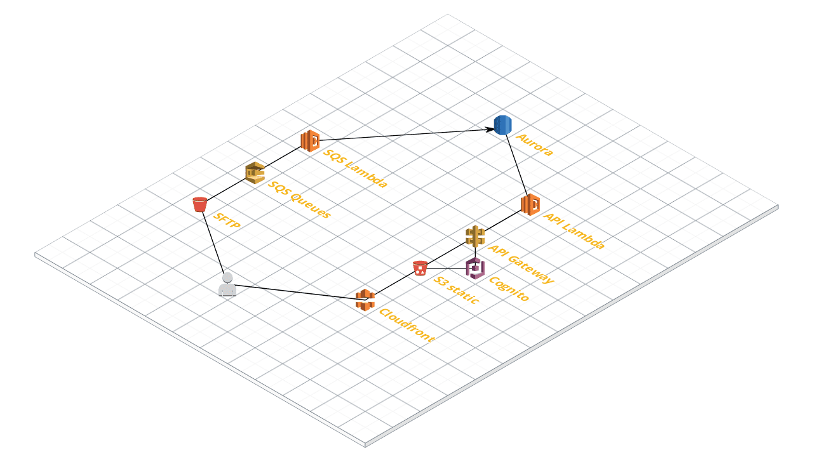

# Serverless Infrastructure example

## Infrastructure map.

## SUMMARY

In this repo you will find a set of Cloudformation stacks to build the infrastructure represented above.
It consists in a whole serverless infrastructure composed by:
- An SFTP server managed by AWS Transfer to SFTP service.
- Three SQS queues to manage the files to be processed.
- Lambda function to process the files.
- An AuroraDB Serverless cluster.
- S3 static website bucket to host our website.
- Cloudfront distribution.
- API Gateway with proxy requests to a Lambda function.
- Cognito User Pool to authenticate the users in our website by mail.
- Lambda function to handle API requests.

How it works? Or what is the idea?

Well, we have an SFTP bucket where our clients our ourselves upload some files to be processed.
This files trigger an event in S3 which ends in a SQS queue being listened by Lambda function which finally process the file and ouputs the result in an Aurora Serverless cluster.
In the other side, we have the website hosted in an S3 bucket, pointing to an API Gateway with an authorizer connected to a Vognito User Pool for the authentication.
After authentication all the requests are proxied to a Lambda which gets values from the Aurora DB to show them in the website.

Keep in mind, this is only infrastructure code, and some improvements are still to be added.
Furthermore, it is already prepared to provide full CI/CD for both, infrastructure and code.
Some stacks creates pipelines in the Codepipeline service and others only creates AWS resources.
______
## INSTRUCTIONS

1. Use the main.yaml to build the whole infrastructure at once.
2. Fill all the parameters and leave the ones that comes by default.
3. The main stack will create a bucket named **app-sourcecodebucket-us-east-1**, you will have to create the following folder structure and upload the .zip files you see in the **zips** folder:
   1. infrastructure/cloudformationtemplate.zip
   2. lambdas/apilambda.zip
   3. lambdas/sqslambda.zip
4. When the pipeline reaches the WEB stage you will be requested to approve an ACM email sent to the domain admin.
5. Upload manually the index.html to the website bucket.
6. Sit and relax until the end.
______
#### Constraints

It can be only deployed in **us-east-1** region, this is because the ACM service and Cloudfront are working together only in this region by the moment.
You need to be owner of the domain and have access to the admin@your.domain or info@your.domain to be able to accept the ACM certificate.
______